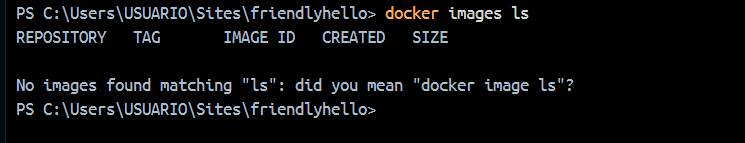

# Taller de Docket

## Creacion de imagen y uso de docker primera parte

## Creacion de Contenedor de Phyton y cracion de imagen

### Prueba de que esta creada

### Arrancar el Contenedor y verificacion de funcionamiento

### Creando la aplicacion (docker-compose.yaml)

### Compartir Imagenes
